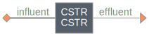

==========================================
asm: Validation of Activated Sludge Models
==========================================

Summary
-------
This module is used to validate the activated sludge models (ASM1 and ASM2d) as in `Henze et al <https://iwaponline.com/ebooks/book/96/Activated-Sludge-Models-ASM1-ASM2-ASM2d-and-ASM3>`_ using a continuous stirred-tank reactor.

The "validation.py" script is used for the validation of the implementation in `WaterTAP <https://github.com/watertap-org/watertap/>`_. The "gps-x" folder contain results from this module and the implementation in `GPS-X <https://www.hydromantis.com/GPSX.html>`_ ("default" for the default setting, "validation" for results from running "validation.py").

   *Layout of the system used for the validation of ASM1/ASM2d implemented in this module*

Load the system
---------------
.. code-block:: python

   >>> from exposan import asm
   >>> process_model = 'ASM2d' # can also be "ASM1"
   >>> aerated = True # can also be False
   >>> asm.load(process_model=process_model, aerated=aerated)
   >>> sys = asm.sys
   >>> sys.simulate(t_span=(0, 10))
   >>> CSTR = sys.flowsheet.unit.CSTR
   >>> # Check the states of any one or more components
   >>> fig, axis = CSTR.scope.plot_time_series(('S_I', 'S_A', 'X_I', 'X_S'))
   >>> fig

.. figure:: ./readme_figures/CSTR_select_states.png

    *Select component states from the continuous stirred tank reactor in the asm module*