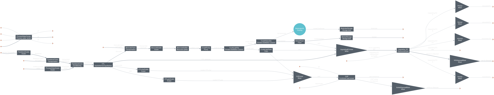

=============================================================================
biobinder: Renewable Biobinder from Hydrothermal Conversion of Organic Wastes
=============================================================================

Summary
-------
This module includes a hydrothermal liquefaction (HTL)-based system for the production of biobinders and valuable coproducts (biobased fuel additives, fertilizers, and potentially hydrogen) from wet organic wastes (food waste and swine manure) based on a project funded by the USDA.

This module has been used to produce the results in Ahmad et al. [1]_ (commit eef4d9dd9864711bfd4995a6fcc5134c5c03e384). Versions of additional packages can be found in `biobinder_environment.yml </exposan/biobinder/biobinder_environment.yml>`_.

The scripts ``fungal.py`` and ``biocrude.py`` modified systems for specific analysis such as fungal treatment of effluent wastewater and raw biocrude production respectively. More settings can be changed for baseline systems in the ``systems.py`` script, the `/analyses </exposan/biobinder/analyses>`_ directory includes multiple sensitivity analyses (with regard to plant size and biocrude yield).

Two main system configurations are included in the module describing the four scenarios each for the configurations discussed in the manuscript, but the system diagram looks identical (the electrochemical [EC] unit is a placeholder that does nothing in the baseline scenario).

    *System diagram.*

System Simulation
-----------------
.. code-block:: python

    # c-HTL
    >>> config_kwargs={'flowsheet': None,
    >>>  'central_dry_flowrate': None,
    >>>  'pilot_dry_flowrate': None,
    >>>  'EC_config': None,
    >>>  'skip_EC': True,
    >>>  'generate_H2': False,
    >>>  'decentralized_HTL': False,
    >>>  'decentralized_upgrading': False}

    >>> sys = create_system(**config_kwargs)
    >>> sys.show()
    System: sys
    ins...
    [0] natural_gas  
        phase: 'g', T: 298.15 K, P: 101325 Pa
        flow (kmol/hr): CH4  14.8
    [1] air  
        phase: 'g', T: 298.15 K, P: 101325 Pa
        flow: 0
    [2] scaled_feedstock  
        phase: 'l', T: 298.15 K, P: 101325 Pa
        flow (kmol/hr): Lipids         11.3
                        Proteins       1.23
                        Carbohydrates  7.55
                        Ash            264
                        H2O            797
    [3] feedstock_trans_surrogate  
        phase: 'l', T: 298.15 K, P: 101325 Pa
        flow (kmol/hr): Lipids         11.3
                        Proteins       1.23
                        Carbohydrates  7.55
                        Ash            264
                        H2O            797
    [4] biocrude_trans_surrogate  
        phase: 'l', T: 333.15 K, P: 206843 Pa
        flow (kmol/hr): Biocrude  9.44
    [5] Upgrading_EC_replacement_surrogate  
        phase: 'l', T: 298.15 K, P: 101325 Pa
        flow: 0
    [6] -  
        phase: 'l', T: 298.15 K, P: 101325 Pa
        flow: 0
    [7] -  
        phase: 'l', T: 298.15 K, P: 101325 Pa
        flow: 0
    [8] -  
        phase: 'l', T: 298.15 K, P: 101325 Pa
        flow: 0
    [9] -  
        phase: 'l', T: 298.15 K, P: 101325 Pa
        flow (kmol/hr): H2O  229
    [10] scaled_process_water  
         phase: 'l', T: 298.15 K, P: 101325 Pa
         flow (kmol/hr): H2O  229
    outs...
    [0] recovered_H2  
        phase: 'l', T: 298.15 K, P: 101325 Pa
        flow: 0
    [1] gas_emissions  
        phase: 'g', T: 298.15 K, P: 101325 Pa
        flow (kmol/hr): CO2  18.4
    [2] ww_to_disposal  
        phase: 'l', T: 333.1 K, P: 101325 Pa
        flow (kmol/hr): HTLaqueous  74.7
                        1E2PYDIN    0.384
                        ETHYLBEN    0.183
                        4M-PHYNO    0.0491
                        4EPHYNOL    0.011
                        INDOLE      2.45e-05
                        7MINDOLE    0.00016
            1.03e+03
    [3] biobinder  
        phase: 'l', T: 298.15 K, P: 344738 Pa
        flow (kmol/hr): 1E2PYDIN  0.109
                        ETHYLBEN  0.0156
                        4M-PHYNO  2.28
                        4EPHYNOL  1.12
                        INDOLE    0.0568
                        7MINDOLE  0.0405
                        C14AMIDE  0.0644
          2.83
    [4] biofuel  
        phase: 'l', T: 298.15 K, P: 101325 Pa
        flow (kmol/hr): 1E2PYDIN  0.0323
                        ETHYLBEN  0.0117
                        4M-PHYNO  0.127
                        4EPHYNOL  1.05
                        INDOLE    2.21
                        7MINDOLE  1.31
                        C14AMIDE  0.183
          3.03
    [5] recovered_K  
        phase: 'l', T: 298.15 K, P: 101325 Pa
        flow: 0
    [6] recovered_N  
        phase: 'l', T: 298.15 K, P: 101325 Pa
        flow: 0
    [7] recovered_P  
        phase: 'l', T: 298.15 K, P: 101325 Pa
        flow: 0
    [8] solids_to_disposal  
        phase: 's', T: 298.15 K, P: 101325 Pa
        flow (kmol/hr): HTLchar  46.2
    [9] Upgrading_EC_gas  
        phase: 'l', T: 298.15 K, P: 101325 Pa
        flow: 0
    [10] s7  
         phase: 'l', T: 298.15 K, P: 101325 Pa
         flow: 0
    [11] s8  
         phase: 'l', T: 298.15 K, P: 101325 Pa
         flow (kmol/hr): H2O  229
    [12] s9  
         phase: 'l', T: 298.15 K, P: 101325 Pa
         flow: 0

    >>> # To see results
    >>> biobinder.simulate_and_print(sys)
    biobinder
    ---------
    Received flowsheet: None
    Creating new flowsheet with ID: bb_CHCU
    Active flowsheet set to: bb_CHCU
    Minimum selling price of the biobinder is $-0.42/kg.
    Global warming potential of the biobinder is -6.2911 kg CO2e/kg.
    

References
----------
.. [1] Ahmad, A.; Kawale, H.; Summers, S.; Bogarin Cantero, B. C.; Allen, C. M.; Hajj, R. M.; Davidson, P. C.; Zhang, Y.; Li, Y. Financial Viability and Carbon Intensity of Hydrothermal Waste Valorization Systems for Bio-Based Asphalt Binder. In Review 2025.
