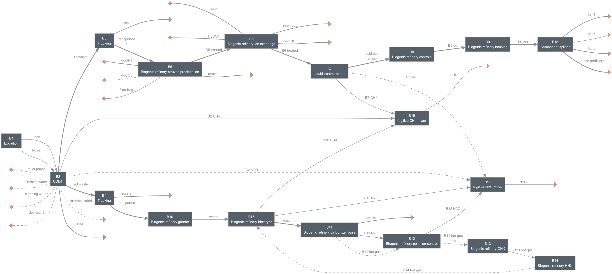
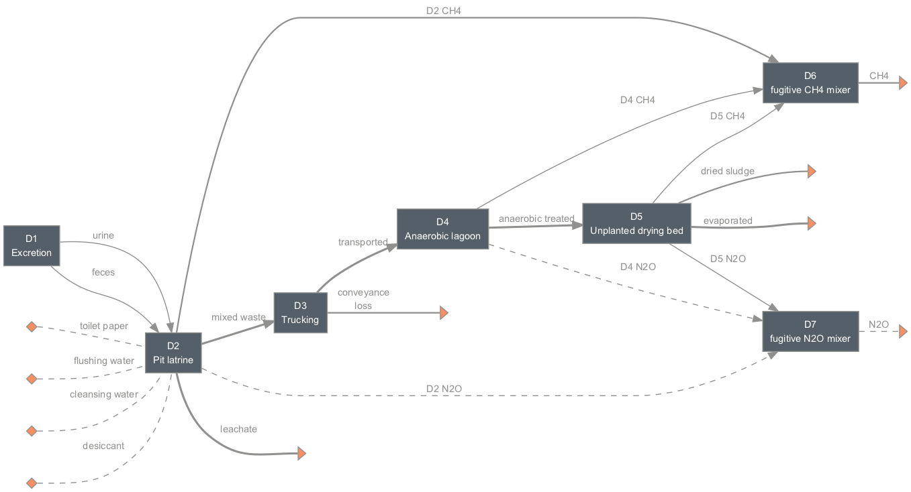

=================
Biogenic Refinery
=================

Summary
-------
Systems included in this module are based on the work described in Rowles et al., [1]_ for a pyrolysis omni process (Biogenic Refinery 4018).

Four system configurations are included in this module.

.. figure:: ./readme_figures/sysA.png

    *Scenario A (sysA): pit latrine with 12,000 users*

    *Scenario B (sysB): urine-diverting dry toilet (UDDT) with 12,000 users*

.. figure:: ./readme_figures/sysC.png

    *Scenario C (sysC): pit latrine with 10,000 users*

    *Scenario D (sysD): pit latrine with 12,000 users without the biogenic refinery*

Loading systems
---------------
.. code-block:: python

    >>> # Import and load the system
    >>> from exposan import biogenic_refinery as br
    >>> br.load()
    >>> # Quick look at the systems
    >>> br.sysA.show() # doctest: +ELLIPSIS
    System: sysA
    ins...
    [0] toilet_paper
        phase: 'l', T: 298.15 K, P: 101325 Pa
        flow: 0
    [1] flushing_water
        phase: 'l', T: 298.15 K, P: 101325 Pa
        flow: 0
    [2] cleansing_water
        phase: 'l', T: 298.15 K, P: 101325 Pa
        flow: 0
    [3] desiccant
        phase: 'l', T: 298.15 K, P: 101325 Pa
        flow: 0
    [4] polymer
        phase: 's', T: 298.15 K, P: 101325 Pa
        flow (kmol/hr): Polyacrylamide  0.00528
    outs...
    [0] CH4
        phase: 'g', T: 298.15 K, P: 101325 Pa
        flow (kmol/hr): CH4  0.0695
    [1] N2O
        phase: 'g', T: 298.15 K, P: 101325 Pa
        flow (kmol/hr): N2O  6.52e-07
    [2] liq_N
        phase: 'l', T: 298.15 K, P: 101325 Pa
        flow (kmol/hr): NH3     0.0355
                        NonNH3  0.0488
    [3] liq_P
        phase: 'l', T: 298.15 K, P: 101325 Pa
        flow (kmol/hr): P  0.0107
    [4] liq_K
        phase: 'l', T: 298.15 K, P: 101325 Pa
        flow (kmol/hr): K  0.0194
    [5] liq_non_fertilizers
        phase: 'l', T: 298.15 K, P: 101325 Pa
        flow (kmol/hr): Mg       0.00653
                        Ca       0.0149
                        H2O      0.643
                        OtherSS  12.4
    [6] leachate
        phase: 'l', T: 298.15 K, P: 101325 Pa
        flow (kmol/hr): NH3  0.0261
                        P    0.00297
                        K    0.00604
                        H2O  8.99
    [7] conveyance_loss
        phase: 'l', T: 298.15 K, P: 101325 Pa
        flow (kmol/hr): NH3      0.000724
                        NonNH3   0.00111
                        P        0.000271
                        K        0.000454
                        Mg       0.000185
                        Ca       0.000544
                        H2O      0.378
                        ...
    [8] biochar
        phase: 'l', T: 298.15 K, P: 101325 Pa
        flow (kmol/hr): H2O      0.00332
                        OtherSS  1.69
                        C        0.0586
    >>> # You can look at individual units
    >>> br.A6.show() # doctest: +ELLIPSIS
    BiogenicRefineryScrewPress: A6
    ins...
    [0] A5_out  from  BiogenicRefineryHousing-A5
        phase: 'l', T: 298.15 K, P: 101325 Pa
        flow (g/hr): NH3      604
                     NonNH3   765
                     P        411
                     K        871
                     Mg       220
                     Ca       1.07e+03
                     H2O      3.34e+05
                     OtherSS  2.49e+04
        WasteStream-specific properties:
         pH         : 7.0
         COD        : 27638.6 mg/L
         TN         : 3762.3 mg/L
         TP         : 1129.3 mg/L
         TK         : 2392.9 mg/L
    [1] polymer
        phase: 's', T: 298.15 K, P: 101325 Pa
        flow (g/hr): Polyacrylamide  376
        WasteStream-specific properties: None for non-liquid waste streams
    outs...
    [0] liq  to  LiquidTreatmentBed-A7
        phase: 'l', T: 298.15 K, P: 101325 Pa
        flow (g/hr): NH3      604
                     NonNH3   683
                     P        331
                     K        758
                     Mg       159
                     Ca       598
                     H2O      1.16e+04
                     OtherSS  1.25e+04
        WasteStream-specific properties:
         pH         : 7.0
         COD        : 182060.6 mg/L
         TN         : 46592.1 mg/L
         TP         : 11976.7 mg/L
         TK         : 27427.2 mg/L
    [1] cake_sol  to  BiogenicRefineryHHXdryer-A12
        phase: 'l', T: 298.15 K, P: 101325 Pa
        flow (g/hr): NonNH3   82.1
                     P        80.1
                     K        113
                     Mg       61.7
                     Ca       470
                     H2O      3.22e+05
                     OtherSS  1.25e+04
        WasteStream-specific properties:
         pH         : 7.0
         COD        : 14954.4 mg/L
         TN         : 244.3 mg/L
         TP         : 238.3 mg/L
         TK         : 336.6 mg/L

Techno-economic analysis and life cycle assessment (TEA/LCA)
------------------------------------------------------------
TEA and LCA are performed through :class:`biosteam.TEA` and :class:`LCA` objects and named as "teaA", "lcaA", etc.

.. code-block:: python

    >>> # Check the TEA results for `sysA`
    >>> br.teaA.show() # doctest: +SKIP
    SimpleTEA: sysA
    NPV  : -1,792,060 USD at 5.0% discount rate
    >>> # There are also handy functions to allow you quickly see important results
    >>> br.print_summaries(br.sysA) # doctest: +SKIP

    ---------- Summary for sysA ----------

    Total N recovery: 37.6 %.

    Total P recovery: 64.7 %.

    Total K recovery: 67.4 %.

    Total cost: 12.46 USD/cap/yr.

    Net emission: 36.23 kg CO2-eq/cap/yr.

    Net ecosystems damage: 0.00 points/cap/yr.

    Net health damage: 10.57 points/cap/yr.

    Net resources damage: 0.01 points/cap/yr.
    >>> # You can also save system reports
    >>> # br.sysA.save_report('full_file_path.xlsx')

Uncertainty and sensitivity analyses
------------------------------------
Uncertainty and sensitivity analyses are performed through :class:`Model` objects. Four models (``modelA`` to ``modelD`` corresponding to ``sysA`` to ``sysD``, respectively) with all the uncertainty parameters and ranges used in Rowles et al. [1]_.

You can make changes (e.g., add or remove parameters, change uncertainty ranges) to these models or construct your own ones.

.. code-block:: python

    >>> # Run the default model for `sysA`
    >>> modelA = br.create_model('A')
    >>> # Try use larger samples, here is just to get a quick demo result
    >>> # The result will be automatically saved under the results folder
    >>> br.run_uncertainty(modelA, N=10) # doctest: +ELLIPSIS
    function `run_uncertainty`
    Total ...

Contextual analysis
-------------------
The ``country_specific.py`` module contains scripts to evaluate the system with contextual parameters that are specific to the deployed country.

References
----------
.. [1] Rowles et al., Financial viability and environmental sustainability of fecal sludge treatment with Omni Processors. ACS Environmental Au. Accepted, 2022. DOI: 10.1021/acsenvironau.2c00022.