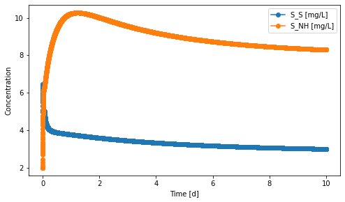

=================================================
bsm1: Benchmark Simulation Model no. 1
=================================================

Summary
-------
This module implements the benchmark simulation model no. 1 (BSM1). [1]_ The code
for process modeling and dynamic simulation has been verified against GPS-X and
MATLAB Simulink [2]_ results.

.. figure:: ./figures/BSM1.png

    *BSM1 system layout: two anoxic suspended-growth bioreactors followed by three aerobic bioreactors and a secondary clarifier*

The Activated Sludge Model no. 1 (ASM1) [3]_ was used to describe biochemical processes
and a simple 1-D 10-layer settling model [4]_ was used for the secondary clarifier.

As of now, the BSM1 system can be simulated dynamically with constant influent.
Fixed aeration is enabled. Idealized aeration control can also be implemented
by setting target dissolved oxygen concentration.

To perform a simulation of the BSM1 model, you can run the `systems.py` script.
Influent loadings, initial conditions, model parameters, system settings, and
solver options can all be customized in the same script.

Future development will include:

    - Enable simulation with dynamic influent
    - Design and costing algorithms of unit operations in the system
    - Aeration control with PI controller

Note that minor modifications have been made to ASM1, specifically:

    - Compared to the original model [3]_, a component ``S_N2`` was added for mass conservation of nitrogen.
    - Compared to the updated model [5]_, the ammonia limitation term was removed from the rate equations of the
      heterotrophic growth processes to be consistent with GPS-X and the MATLAB Simulink [2]_ implementation.

The most updated version of ASM1 per Rieger et al. [5]_ is available in `QSDsan <https://github.com/QSD-Group/QSDsan/blob/main/qsdsan/processes>`_.
You can choose to work with the updated version by changing the file path in the `systems.py` script or replace the `_asm1.tsv` file with
the one in `QSDsan <https://github.com/QSD-Group/QSDsan/tree/main/qsdsan/data/process_data>`_.

Load BSM1 system with default settings
--------------------------------------
.. code-block:: python

  >>> # Import bsm1 module
  >>> from exposan import bsm1 as bsm
  >>> bsm.bsm1.show()
  System: BSM1
  Highest convergence error among components in recycle
  streams {S2-0, S1-0} after 0 loops:
  - flow rate   0.00e+00 kmol/hr (0%)
  - temperature 0.00e+00 K (0%)
  ins...
  [0] Wastewater
      phase: 'l', T: 293.15 K, P: 101325 Pa
      flow (kmol/hr): S_I    23.1
                      S_S    53.4
                      X_I    39.4
                      X_S    155
                      X_BH   21.7
                      S_NH   1.42
                      S_ND   0.381
                      ...
  outs...
  [0] Effluent
      phase: 'l', T: 293.15 K, P: 101325 Pa
      flow: 0
  [1] WAS
      phase: 'l', T: 293.15 K, P: 101325 Pa
      flow: 0

  >>> # You can look at individual units
  >>> bsm.C1.show()
  FlatBottomCircularClarifier: C1
  ins...
  [0] treated  from  Splitter-S1
      phase: 'l', T: 298.15 K, P: 101325 Pa
      flow: 0
      WasteStream-specific properties: None for empty waste streams
  outs...
  [0] Effluent
      phase: 'l', T: 293.15 K, P: 101325 Pa
      flow: 0
      WasteStream-specific properties: None for empty waste streams
  [1] sludge  to  Splitter-S2
      phase: 'l', T: 298.15 K, P: 101325 Pa
      flow: 0
      WasteStream-specific properties: None for empty waste streams

  >>> # You can also look at a specific model
  >>> bsm.aer1.show()
  Process: aer1
  [stoichiometry] S_O: 1
  [reference]     S_O
  [rate equation] KLa*(DOsat - S_O)
  [parameters]    KLa: 240
                  DOsat: 8

Adjust model settings
---------------------
.. code-block:: python

    >>> # You can set the initial concentrations in a CSTR
    >>> bsm.A1.set_init_conc(S_I=30, S_S=5.0, X_I=1000, X_S=100, X_BH=500, X_BA=100,
                             X_P=100, S_O=2.0, S_NH=2.0, S_ND=1.0, X_ND=1.0,
                             S_NO=20, S_ALK=7*12)
    >>> bsm.A1.state
    {'S_I': 30.0,
     'S_S': 5.0,
     'X_I': 1000.0,
     'X_S': 100.0,
     'X_BH': 500.0,
     'X_BA': 100.0,
     'X_P': 100.0,
     'S_O': 2.0,
     'S_NO': 20.0,
     'S_NH': 2.0,
     'S_ND': 1.0,
     'X_ND': 1.0,
     'S_ALK': 84.0,
     'S_N2': 0.0,
     'H2O': 0.0,
     'Q': 92229.99999998896}

     >>> # You can also set the initial TSS and solids composition in a clarifier
     >>> bsm.C1.set_init_TSS([12.4969, 18.1132, 29.5402, 68.9781, 356.0747,
                              356.0747, 356.0747, 356.0747, 356.0747, 6393.9844])
     >>> bsm.C1.set_init_sludge_solids(X_I=1507, X_S=89.3, X_BH=5913, X_BA=372.6,
                                       X_P=641.7, X_ND=2.32)

Biochemical process model parameters such as ASM1's stoichiometric or kinetic
parameters can be customized upon and after initiation of the ``CompiledProcesses`` object.
See `process <https://qsdsan.readthedocs.io/en/latest/Process.html#compiledprocesses>`_
module for more details.

Unit operation settings, such as, reactor dimensions, number of settling layers, and
settling parameters, can also be customized upon and after initiation of the
corresponding `SanUnit`.

Perform dynamic simulations
---------------------------
Dynamic simulation of the BSM1 system can be performed with the built in `simulate`
method. A system of ordinary differential equations (ODEs) is compiled upon the
initiation of the `System` object. Detailed settings regarding the ODE solver can
be adjusted by passing keyword arguments to the `simulate` method. See
`biosteam <https://biosteam.readthedocs.io/en/latest/System.html#biosteam.System.simulate>`_
and for more information.

.. code-block:: python

    >>> # Simulate with default solver and default settings.
    >>> from exposan.bsm1 import bsm1
    >>> bsm1.simulate(t_span = (0,10))
    Simulation completed.
    >>> # The state variables in each unit can be plotted over time after simulation.
    >>> bsm1.units[0].plot_state_over_time(system = bsm1, state_var = ('S_S', 'S_NH'))
    (<Figure size 576x324 with 1 Axes>,
     <AxesSubplot:xlabel='Time [d]', ylabel='Concentration'>)

.. code-block:: python

    >>> # You can also look at the final state of a specific stream after simulation
    >>> bsm1.outs[0].show()
    WasteStream: Effluent from <FlatBottomCircularClarifier: C1>
     phase: 'l', T: 293.15 K, P: 101325 Pa
     flow (g/hr): S_I    2.26e+04
                  S_S    691
                  X_I    3.18e+03
                  X_S    141
                  X_BH   7.1e+03
                  X_BA   414
                  X_P    1.25e+03
                  S_O    401
                  S_NO   7.98e+03
                  S_NH   1.7e+03
                  S_ND   535
                  X_ND   10
                  S_ALK  3.75e+04
                  S_N2   1.97e+04
                  H2O    7.5e+08
     WasteStream-specific properties:
      pH         : 7.0
      COD        : 47.0 mg/L
      BOD        : 6.4 mg/L
      TC         : 65.4 mg/L
      TOC        : 15.6 mg/L
      TN         : 14.7 mg/L
      TKN        : 14.7 mg/L
      TP         : 0.6 mg/L
      TK         : 0.1 mg/L
     Component concentrations (mg/L):
      S_I    30.0
      S_S    0.9
      X_I    4.2
      X_S    0.2
      X_BH   9.4
      X_BA   0.6
      X_P    1.7
      S_O    0.5
      S_NO   10.6
      S_NH   2.3
      S_ND   0.7
      X_ND   0.0
      S_ALK  49.8
      S_N2   26.2
      H2O    996500.4

References
----------
.. [1] Alex et al., Benchmark simulation model no. 1 (BSM1). Report by the
       IWA Taskgroup on benchmarking of control strategies for WWTPs (2008): 19-20.
       `<http://iwa-mia.org/benchmarking/#BSM1>`_
.. [2] Gernaey et al., Benchmarking of control strategies for wastewater treatment
       plants. IWA publishing, 2014. `<https://github.com/wwtmodels/Benchmark-Simulation-Models>`_
.. [3] Henze et al., Activated sludge models ASM1, ASM2, ASM2d and ASM3. IWA publishing, 2000.
.. [4] Takács et al., A Dynamic Model of the Clarification-Thickening Process.
       Water Res. 1991, 25 (10), 1263–1271. `<https://doi.org/10.1016/0043-1354(91)90066-Y.>`_
.. [5] Rieger et al., Guidelines for Using Activated Sludge Models.
       IWA Publishing: London, New York, 2012; Vol. 11. `<https://doi.org/10.2166/9781780401164.>`_
