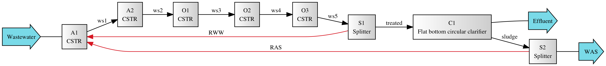
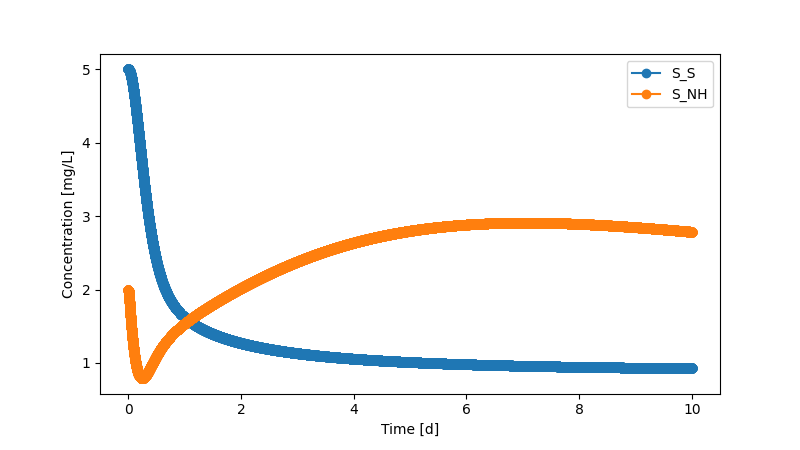
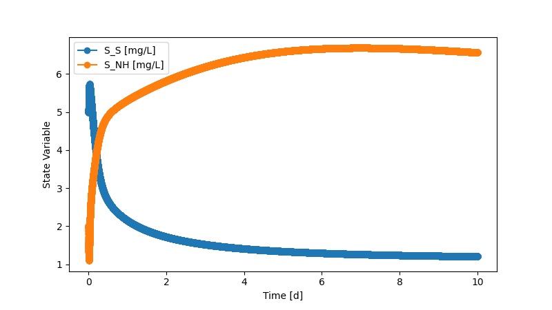

======================================
bsm1: Benchmark Simulation Model No. 1
======================================

Summary
-------
This module implements the Benchmark Simulation Model No. 1 (BSM1). [1]_ The code for process modeling and dynamic simulation has been verified against the MATLAB/Simulink [2]_ implementation developed by International Water Association (IWA) Task Group on Benchmarking of Control Strategies. The ``data`` folder contains the outputs from MATLAB/Simulink results (``matlab_exported_data.xlsx`` and ``matlab_workspace.mat``) for comparison.

    *BSM1 system layout: two anoxic suspended-growth bioreactors followed by three aerobic bioreactors and a secondary clarifier*

The Activated Sludge Model No. 1 (ASM1) [3]_ was used to describe biochemical processes and a simple 1-D 10-layer settling model [4]_ was used for the secondary clarifier.

As of now, the BSM1 system can be simulated dynamically with constant or dynamic influents. Fixed aeration is enabled. Idealized aeration control can also be implemented by setting target dissolved oxygen concentration.

To reproduce the results and figures (saved in ``cached_results_figures``) included in Li and Zhang et al. [5]_, directly run ``analyses.py``. You can find a full list of the packages in the environment used to generate the results in `qsdsan.yml <https://github.com/QSD-Group/EXPOsan/blob/main/exposan/bwaise/qsdsan.yml>`_. Note that the environment was in macOS, other OS users can consult it for the versions of the dependency packages and install them accordingly.

If you want to look at unit/system diagram, you will want to have the package ``Graphviz`` correctly installed in your environment (read more about this on `QSDsan's documentation <https://qsdsan.readthedocs.io/en/latest/FAQ.html#graphviz>`_).

To perform a simulation of the BSM1 model, you can import the module (as shown below) or directly run the ``system.py`` script. Influent loadings, initial conditions, model parameters, system settings, and solver options can all be customized in the same script.

Future development will include:

    - Design and costing algorithms of unit operations in the system
    - Aeration control with PI or PID controller

Note that minor modifications have been made to ASM1, specifically:

    - Compared to the original model [3]_, a component ``S_N2`` was added for mass conservation of nitrogen.
    - Compared to the updated model [6]_, the ammonia limitation term was removed from the rate equations of the
      heterotrophic growth processes to be consistent with GPS-X and the MATLAB Simulink [2]_ implementation.

The most updated version of ASM1 per Rieger et al. [6]_ is available in `QSDsan <https://github.com/QSD-Group/QSDsan/blob/main/qsdsan/processes>`_. You can choose to work with the updated version by changing the file path in the ``system.py`` script or replace the ``_asm1.tsv`` file with the one in `QSDsan <https://github.com/QSD-Group/QSDsan/tree/main/qsdsan/data/process_data>`_.

Load BSM1 system with default settings
--------------------------------------
.. code-block:: python

  >>> # Import bsm1 module
  >>> from exposan import bsm1 as bsm
  >>> bsm.bsm1.show() # doctest: +SKIP
  System: BSM1
  Highest convergence error among components in recycle
  streams {C1-1, O3-0} after 0 loops:
  - flow rate   0.00e+00 kmol/hr (0%)
  - temperature 0.00e+00 K (0%)
  ins...
  [0] Wastewater
      phase: 'l', T: 293.15 K, P: 101325 Pa
      flow (kmol/hr): S_I    23.1
                      S_S    53.4
                      X_I    39.4
                      X_S    155
                      X_BH   21.7
                      S_NH   1.42
                      S_ND   0.381
                      ...
  outs...
  [0] Effluent
      phase: 'l', T: 293.15 K, P: 101325 Pa
      flow: 0
  [1] WAS
      phase: 'l', T: 293.15 K, P: 101325 Pa
      flow: 0
  >>> # You can look at individual units
  >>> bsm.C1.show()
  FlatBottomCircularClarifier: C1
  ins...
  [0] treated  from  CSTR-O3
      phase: 'l', T: 298.15 K, P: 101325 Pa
      flow: 0
      WasteStream-specific properties: None for empty waste streams
  outs...
  [0] Effluent
      phase: 'l', T: 293.15 K, P: 101325 Pa
      flow: 0
      WasteStream-specific properties: None for empty waste streams
  [1] RAS  to  CSTR-A1
      phase: 'l', T: 293.15 K, P: 101325 Pa
      flow: 0
      WasteStream-specific properties: None for empty waste streams
  [2] WAS
      phase: 'l', T: 293.15 K, P: 101325 Pa
      flow: 0
      WasteStream-specific properties: None for empty waste streams
  >>> # You can also look at a specific model
  >>> bsm.aer1.show()
  Process: aer1
  [stoichiometry] S_O: 1
  [reference]     S_O
  [rate equation] KLa*(DOsat - S_O)
  [parameters]    KLa: 240
                  DOsat: 8

Adjust model settings
---------------------
.. code-block:: python

    >>> # You can set the initial concentrations in a CSTR
    >>> bsm.A1.set_init_conc(S_I=30, S_S=5.0, X_I=1000, X_S=100, X_BH=500, X_BA=100,
    ...                      X_P=100, S_O=2.0, S_NH=2.0, S_ND=1.0, X_ND=1.0,
    ...                      S_NO=20, S_ALK=7*12)
    >>> # You can also set the initial TSS and solids composition in a clarifier
    >>> bsm.C1.set_init_TSS([12.4969, 18.1132, 29.5402, 68.9781, 356.0747,
    ...                     356.0747, 356.0747, 356.0747, 356.0747, 6393.9844])
    >>> bsm.C1.set_init_sludge_solids(X_I=1507, X_S=89.3, X_BH=5913, X_BA=372.6,
    ...                               X_P=641.7, X_ND=2.32)

Biochemical process model parameters such as ASM1's stoichiometric or kinetic parameters can be customized upon and after initiation of the ``CompiledProcesses`` object. See `process <https://qsdsan.readthedocs.io/en/latest/Process.html#compiledprocesses>`_
module for more details.

Unit operation settings, such as, reactor dimensions, number of settling layers, and settling parameters, can also be customized upon and after initiation of the corresponding ``SanUnit``.

Perform dynamic simulations
---------------------------
Dynamic simulation of the BSM1 system can be performed with the built in `simulate`method. A system of ordinary differential equations (ODEs) is compiled upon the initiation of the `System` object. Detailed settings regarding the ODE solver can be adjusted by passing keyword arguments to the `simulate` method. See `biosteam <https://biosteam.readthedocs.io/en/latest/System.html#biosteam.System.simulate>`_ for more information.

.. code-block:: python

    >>> # Simulate with default solver and default settings.
    >>> # Set the dynamic tracker prior to simulation
    >>> # if you want to track the state of a certain stream or unit
    >>> from exposan.bsm1 import bsm1, RAS, O1
    >>> bsm1.set_dynamic_tracker(RAS, O1)
    >>> bsm1.simulate(t_span=(0,10), method='BDF')
    Simulation completed.
    >>> # The state variables in each unit can be plotted over time
    >>> RAS.scope.plot_time_series(('S_S', 'S_NH')) # doctest: +ELLIPSIS
    (<Figure size ...
    >>> O1.scope.plot_time_series(('S_S', 'S_NH')) # doctest: +ELLIPSIS
    (<Figure size ...
    >>> # Or you can retrieve the time-series record after simulation
    >>> # at desired time step
    >>> bsm1.scope.export(t_eval=range(10)) # doctest: +ELLIPSIS
    ID ...

    *Time-series state of return activated sludge (RAS)*

    *Time-series state of the first aerobic CSTR (O1)*

.. code-block:: python

    >>> # You can also look at the final state of a specific stream after simulation
    >>> bsm1.outs[1].show()
    WasteStream: WAS from <FlatBottomCircularClarifier: C1>
     phase: 'l', T: 293.15 K, P: 101325 Pa
     flow (g/hr): S_I    481
                  S_S    14.8
                  X_I    3.47e+04
                  X_S    1.47e+03
                  X_BH   7.34e+04
                  X_BA   4.17e+03
                  X_P    8.81e+03
                  S_O    8.52
                  S_NO   166
                  S_NH   41.7
                  S_ND   11.5
                  X_ND   104
                  S_ALK  807
                  S_N2   418
                  H2O    1.59e+07
     WasteStream-specific properties:
      pH         : 7.0
      COD        : 7669.3 mg/L
      BOD        : 2792.6 mg/L
      TC         : 2752.5 mg/L
      TOC        : 2702.2 mg/L
      TN         : 569.6 mg/L
      TP         : 120.2 mg/L
      TK         : 25.7 mg/L
     Component concentrations (mg/L):
      S_I    30.0
      S_S    0.9
      X_I    2163.9
      X_S    91.7
      X_BH   4573.8
      X_BA   259.7
      X_P    549.4
      S_O    0.5
      S_NO   10.3
      S_NH   2.6
      S_ND   0.7
      X_ND   6.5
      S_ALK  50.3
      S_N2   26.1
      H2O    993889.0

References
----------
.. [1] Alex et al., Benchmark simulation model no. 1 (BSM1). Report by the IWA Taskgroup on benchmarking of control strategies for WWTPs (2008): 19-20. `<http://iwa-mia.org/benchmarking/#BSM1>`_
.. [2] Gernaey et al., Benchmarking of control strategies for wastewater treatment plants. IWA publishing, 2014. `<https://github.com/wwtmodels/Benchmark-Simulation-Models>`_
.. [3] Henze et al., Activated sludge models ASM1, ASM2, ASM2d and ASM3. IWA publishing, 2000.
.. [4] Takács et al., A Dynamic Model of the Clarification-Thickening Process. Water Res. 1991, 25 (10), 1263–1271. `<https://doi.org/10.1016/0043-1354(91)90066-Y.>`_
.. [5] Li and  Zhang et al., QSDsan: An Integrated Platform for Quantitative Sustainable Design of Sanitation and Resource Recovery Systems. *In Prep.*
.. [6] Rieger et al., Guidelines for Using Activated Sludge Models. IWA Publishing: London, New York, 2012; Vol. 11. `<https://doi.org/10.2166/9781780401164.>`_
