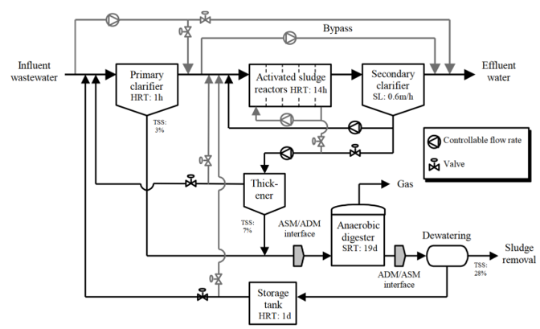
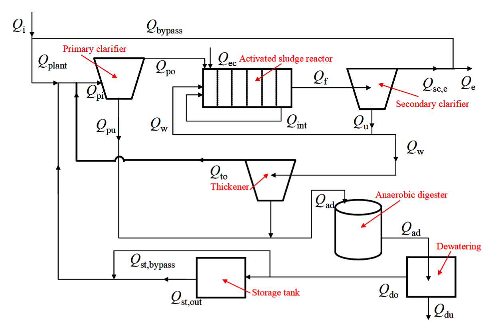
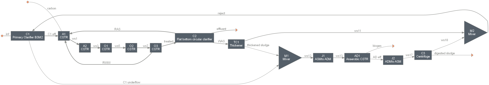

======================================
bsm2: Benchmark Simulation Model No. 2
======================================

Summary
-------
This module contains the Benchmark Simulation Model No. 2 (BSM2) [1]_ configuration (currently open-loop, constant influent) developed by the International Water Association (IWA).

A single ``create_system`` function builds either of two configurations via the ``kind`` argument:

- ``kind='bsm2'`` (default): the classic BSM2 using ASM1 + ADM1.
- ``kind='bsm2p'``: a phosphorus-removal variant using mASM2d + ADM1p.

The activated-sludge reactor train can be modeled as a series of CSTRs or as a single PFR through the ``reactor_model`` argument (defaulting to ``'CSTR'`` for ``'bsm2'`` and ``'PFR'`` for ``'bsm2p'``).

.. note::

    ``system.create_subsys`` builds ``bsm1p``, the activated-sludge sub-train of the ``bsm2p`` plant. It is a diagnostic system for studying the bioreactor train in isolation, not a published benchmark, and is intentionally not exposed through ``create_system``.

    *BSM2 system layout as developed by IWA.*

    *BSM2 system layout with flow notations.*

Load the system
---------------
.. code-block:: python

	>>> from exposan import bsm2
	>>> # bsm2.load()                 # the classic BSM2 (kind='bsm2', the default)
	>>> # bsm2.load(kind='bsm2p')     # the phosphorus-removal variant
	>>> sys = bsm2.sys
	>>> # sys.simulate(method='RK23', t_span=(0, 15))    # works for RK45, RK23, or DOP853
	>>> # Check the states of any one or more components
	>>> # fig, axis = bsm2.AD1.scope.plot_time_series(u.AD1.components.IDs[:3])
	>>> # fig

    *Current module diagram.*

References
----------
.. [1] Alex, J.; Benedetti, L.; Copp, J. B.; Gernaey, K. V.; Jeppsson, U.; Nopens, I.; Pons, M. N.; Rosen, C.; Steyer, J. P.; Vanrolleghem, P. A. Benchmark Simulation Model No. 2 (BSM2). `<http://iwa-mia.org/benchmarking/#BSM2>`_
