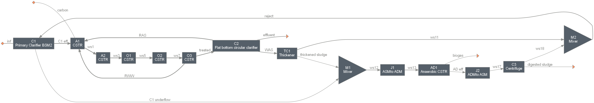

======================================
bsm2: Benchmark Simulation Model No. 2
======================================

Summary
-------
This modules contains the Benchmark Simulation Model No. 2 (BSM2) [1]_ configuration (currently open-loop, constant influent) developed by the International Water Association (IWA).

.. figure:: ./readme_figures/bsm2_iwa.svg

    *BSM2 system layout as developed by IWA.*

    *BSM2 system layout with flow notations.*

Load the system
---------------
.. code-block:: python

	>>> from exposan import bsm2
	>>> # bsm2.load()
	>>> sys = bsm2.sys
	>>> # sys.simulate(method='RK23', t_span=(0, 15))    # works for RK45, RK23, or DOP853
	>>> # Check the states of any one or more components
	>>> # fig, axis = bsm2.AD1.scope.plot_time_series(u.AD1.components.IDs[:3])
	>>> # fig

    *Current module diagram.*

References
----------
.. [1] Alex, J.; Benedetti, L.; Copp, J. B.; Gernaey, K. V.; Jeppsson, U.; Nopens, I.; Pons, M. N.; Rosen, C.; Steyer, J. P.; Vanrolleghem, P. A. Benchmark Simulation Model No. 2 (BSM2). `<http://iwa-mia.org/benchmarking/#BSM2>`_
