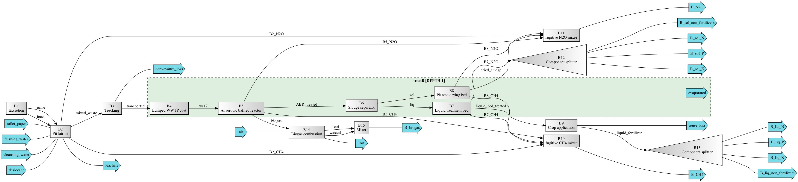

=================================================
bwaise: Sanitation Alternatives in Bwaise, Uganda
=================================================

Summary
-------
Systems included in this module are based on Scenarios A-C as described in Trimmer et al. [1]_ and named as "sysA", "sysB", and "sysC". Previous scripts developed for modeling and analyses of the systems can be found in another `repository <https://github.com/QSD-Group/Bwaise-sanitation-alternatives>`_.

Results generated from this module have been benchmarked against Trimmer et al. [1]_ and you can find the result comparison in the ``comparison`` folder. The folder ``data`` contains data needed to run the module, and ``figures`` and ``results`` contain the archived figures and results generated for Li and Zhang et al. [2]_ 

To reproduce the results and figures (saved in ``cached_results_figures``) included in Li and Zhang et al. [2]_, directly run ``systems.py``/``analyses.py`` (before running ``analyses.py``, you'll want to adjust the number of simulations, and you'll need to run from scratch the first time you run to generate the data). You'll need the package `adjustText <https://github.com/Phlya/adjustText>`_ in addition to ``EXPOsan``'s requirements.

You can find a full list of the packages in the environment used to generate the results in `qsdsan.yml <https://github.com/QSD-Group/EXPOsan/blob/main/exposan/bwaise/qsdsan.yml>`_. Note that the environment was in macOS, other OS users can consult it for the versions of the dependency packages and install them accordingly.

 Additionally, you will want to have the package ``Graphviz`` correctly installed in your environment (read more about this on `QSDsan's documentation <https://qsdsan.readthedocs.io/en/latest/FAQ.html#graphviz>`_).

To run the module developed in Trimmer et al. [1]_, you can run the `Bwaise_sanitation_model.py` script in either `baseline <https://github.com/QSD-Group/EXPOsan/tree/main/exposan/bwaise/comparison/baseline>`_ or `uncertainty <https://github.com/QSD-Group/EXPOsan/tree/main/exposan/bwaise/comparison/uncertainty>`_.

Note that minor modifications have been made in the scripts, specifically:

    - Baseline characterization factor of the electricity has been changed in the input spreadsheet
    - Degradation algorithm for ``dehydration_vault`` has been updated in ``decentralized_storage.py``
    - Degradation algorithms for all treatment functions with first-order decay have been updated in ``treatment.py``
    - The emission calculation of `ABR` has been updated.

The change in the spreadsheet is denoted by red font with a note, and all changes in the scripts have been noted with `#!!!`, the original value/codes are saved either in the spreadsheet note or as comments.

.. figure:: ./figures/sysA.png

    *Scenario A (sysA): pit latrine with existing treatment system*

    *Scenario B (sysB): pit latrine with anaerobic treatment*

.. figure:: ./figures/sysC.png

    *Scenario C (sysC): container-based toilet (urine diverting dry toilet, UDDT) with existing treatment system*

Loading systems
---------------
.. code-block:: python

    >>> # Import bwaise systems as modules
    >>> from exposan import bwaise as bw
    >>> # You can repeat these for `sysB` and `sysC`
    >>> bw.sysA.show() # doctest: +ELLIPSIS
    System: sysA
    ins...
    [0] toilet_paper
        phase: 'l', T: 298.15 K, P: 101325 Pa
        flow (kmol/hr): Tissue  0.000282
    [1] flushing_water
        phase: 'l', T: 298.15 K, P: 101325 Pa
        flow (kmol/hr): H2O  0.0231
    [2] cleansing_water
        phase: 'l', T: 298.15 K, P: 101325 Pa
        flow: 0
    [3] desiccant
        phase: 'l', T: 298.15 K, P: 101325 Pa
        flow: 0
    outs...
    [0] A_CH4
        phase: 'g', T: 298.15 K, P: 101325 Pa
        flow (kmol/hr): CH4  5.57
    [1] A_N2O
        phase: 'g', T: 298.15 K, P: 101325 Pa
        flow (kmol/hr): N2O  0.0215
    [2] A_sol_N
        phase: 'l', T: 298.15 K, P: 101325 Pa
        flow (kmol/hr): NonNH3  0.0482
    [3] A_sol_P
        phase: 'l', T: 298.15 K, P: 101325 Pa
        flow (kmol/hr): P  0.0984
    [4] A_sol_K
        phase: 'l', T: 298.15 K, P: 101325 Pa
        flow (kmol/hr): K  0.11
    [5] A_sol_non_fertilizers
        phase: 'l', T: 298.15 K, P: 101325 Pa
        flow (kmol/hr): Mg       0.0967
                        Ca       0.446
                        H2O      12.4
                        OtherSS  50.1
    [6] A_liq_N
        phase: 'l', T: 298.15 K, P: 101325 Pa
        flow (kmol/hr): NonNH3  0.846
    [7] A_liq_P
        phase: 'l', T: 298.15 K, P: 101325 Pa
        flow (kmol/hr): P  0.159
    [8] A_liq_K
        phase: 'l', T: 298.15 K, P: 101325 Pa
        flow (kmol/hr): K  0.723
    [9] A_liq_non_fertilizers
        phase: 'l', T: 298.15 K, P: 101325 Pa
        flow (kmol/hr): Mg       0.244
                        Ca       0.557
                        H2O      601
                        OtherSS  42.7
                        Tissue   126
    [10] leachate
        phase: 'l', T: 298.15 K, P: 101325 Pa
        flow (kmol/hr): NH3  0.995
                        P    0.113
                        K    0.23
                        H2O  2.56e+03
    [11] conveyance_loss
        phase: 'l', T: 298.15 K, P: 101325 Pa
        flow (kmol/hr): NH3      0.0275
                        NonNH3   0.0424
                        P        0.0103
                        K        0.0173
                        Mg       0.00705
                        Ca       0.0207
                        H2O      14.2
                        ...
    [12] evaporated
        phase: 'g', T: 298.15 K, P: 101325 Pa
        flow (kmol/hr): H2O  84.2
    [13] reuse_loss
        phase: 'l', T: 298.15 K, P: 101325 Pa
        flow (kmol/hr): NonNH3  0.0173
                        P       0.00325
                        K       0.0147
                        Mg      0.00497
                        Ca      0.0114
    >>> # You can look at individual units
    >>> bw.A1.show() # doctest: +ELLIPSIS
    Excretion: A1
    ins...
    outs...
    [0] urine  to  PitLatrine-A2
        phase: 'l', T: 298.15 K, P: 101325 Pa
        flow (g/hr): NH3      0.213
                     NonNH3   0.0377
                     P        0.026
                     K        0.0694
                     Mg       0.00833
                     Ca       0.0117
                     H2O      55.4
                     OtherSS  2.55
        WasteStream-specific properties:
         pH         : 7.0
         COD        : 5156.4 mg/L
         TN         : 4282.2 mg/L
         TP         : 443.3 mg/L
         TK         : 1182.7 mg/L
    [1] feces  to  PitLatrine-A2
        phase: 'l', T: 298.15 K, P: 101325 Pa
        flow (g/hr): NH3      0.00685
                     NonNH3   0.0274
                     P        0.0166
                     K        0.0244
                     Mg       0.0104
                     Ca       0.0792
                     H2O      8.85
                     OtherSS  1.4
        WasteStream-specific properties:
         pH         : 7.0
         COD        : 123381.8 mg/L
         TN         : 3277.5 mg/L
         TP         : 1590.6 mg/L
         TK         : 2332.3 mg/L

Techno-economic analysis and life cycle assessment (TEA/LCA)
------------------------------------------------------------
TEA and LCA are performed through :class:`biosteam.TEA` and :class:`LCA` objects and named as "teaA", "lcaA", etc.

.. code-block:: python

    >>> # Check the TEA results for `sysA`
    >>> bw.teaA.show() # doctest: +SKIP
    SimpleTEA: sysA
    NPV  : -42,012,580 USD at 5.0% discount rate
    >>> # There are also handy functions to allow you quickly see important results
    >>> bw.print_summaries(bw.sysA) # doctest: +SKIP

    ---------- Summary for sysA ----------

    Total COD recovery is 5.1%, 2.3% in liquid, 2.8% in solid, 0.0% in gas.
    Total N recovery is 9.6%, 9.1% in liquid, 0.5% in solid, 0.0% in gas.
    Total P recovery is 41.0%, 25.4% in liquid, 15.7% in solid, 0.0% in gas.
    Total K recovery is 76.1%, 66.0% in liquid, 10.1% in solid, 0.0% in gas.

    SimpleTEA: sysA
    NPV  : -42,012,580 USD at 5.0% discount rate

    Net cost: 14.2 USD/cap/yr.
    Capital: 10.6 USD/cap/yr.
    Operating: 4.0 USD/cap/yr.
    Sales: 0.5 USD/cap/yr.

    LCA: sysA (lifetime 8 yr)
    Impacts:
                               Construction  Transportation   Stream   Others    Total
    GlobalWarming (kg CO2-eq)      3.13e+07        9.57e+05 1.82e+08 5.19e+04 2.14e+08

    Impact indicator GlobalWarming:

    Net emission: 58.6 kg CO2-eq/cap/yr.
    Construction: 8.6 kg CO2-eq/cap/yr.
    Transportation: 0.3 kg CO2-eq/cap/yr.
    Direct emission: 52.8 kg CO2-eq/cap/yr.
    Offset: -3.0 kg CO2-eq/cap/yr.
    Other: 0.01 kg CO2-eq/cap/yr.
    >>> # You can save reports in the "/results" folder with default names
    >>> # Note that system information (e.g., flows, designs) and TEA results
    >>> # will be saved together, but LCA result will be saved in a separate Excel file
    >>> # bw.save_all_reports()
    >>> # Alternatively, you can save individual reports at other places
    >>> # bw.sysA.save_report('sysA_report.xlsx')

Uncertainty and sensitivity analyses
------------------------------------
These analyses are performed through :class:`biosteam.Model` objects, three models (``modelA``, ``modelB``, ``modelC`` for ``sysA``, ``sysB``, and ``sysC``, respectively) have been added with all the uncertainty parameters and ranges according to Trimmer et al. [1]_.

You can make changes (e.g., add or remove parameters, change uncertainty ranges) to these models or construct your own ones.

.. code-block:: python

    >>> # Run the default model for `sysA`
    >>> models = bw.models
    >>> # Try use larger samples, here is just to get a quick demo result
    >>> models.run_uncertainty(models.modelA, N=10) # doctest: +ELLIPSIS
    function `run_uncertainty`
    Total ...
    >>> # Your results will be cached in `models.result_dct['sysA']`
    >>> # You can organize the results as you like,
    >>> # but you can also save them using the default organized data
    >>> # models.save_uncertainty_results(models.modelA)

``QSDsan`` also have built-in functions for advanced global sensitivity analyses and plotting functions, refer to the `stats <https://qsdsan.readthedocs.io/en/latest/stats.html>`_ module for examples.

References
----------
.. [1] Trimmer et al., Navigating Multidimensional Social–Ecological System Trade-Offs across Sanitation Alternatives in an Urban Informal Settlement. Environ. Sci. Technol. 2020, 54 (19), 12641–12653. `<https://doi.org/10.1021/acs.est.0c03296>`_
.. [2] Li and  Zhang et al., QSDsan: An Integrated Platform for Quantitative Sustainable Design of Sanitation and Resource Recovery Systems. *In Prep.*