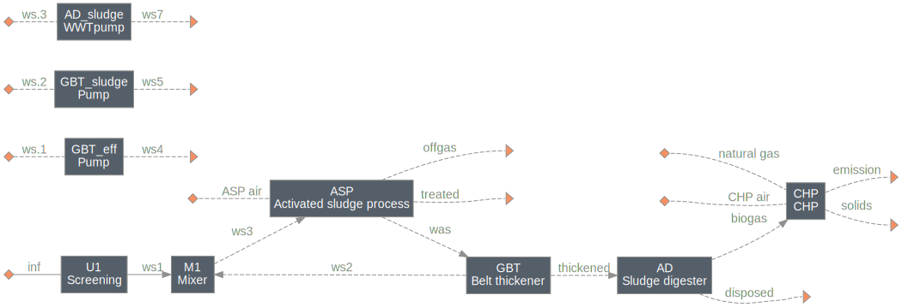

==========================================
cas: Conventional Activated Sludge Process
==========================================

Summary
-------
This module is intended to test several units usually used in a wastewater treatment plant with the conventional activated sludge process. A simple system layout has been completed, but no cost or environmental impact analyses have been added.

    *CAS system layout*

Load the system
---------------
.. code-block:: python

	>>> from exposan import cas
	>>> cas.load()
	>>> cas.sys.diagram()