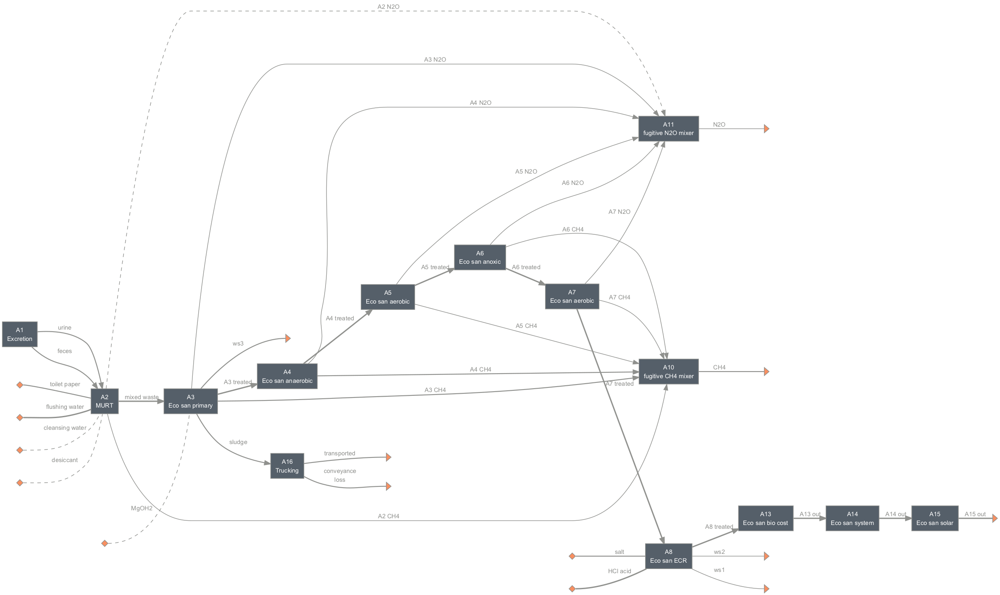
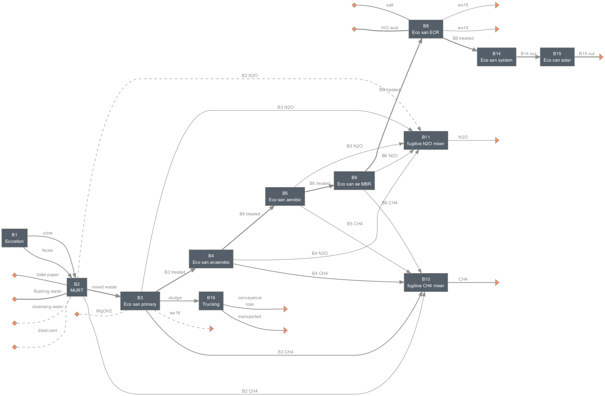

=======
Eco-San
=======

Summary
-------
Systems included in this module are based on the `Eco-San <http://www.eco-san.cn/e_main.html>`_ system developed by Yixing Eco-sanitary Manufacture Co.

Three system configurations are included in this module.

    *Scenario A (sysA): anaerobic-aerobic-anoxic-aerobic-electrochemical reactor (ECR)*

    *Scenario B (sysB): anaerobic-aerobic-aerobic membrane bioreactor (AeMBR)-ECR*

.. figure:: ./figures/sysC.png

    *Scenario C (sysC): sysB with struvite precipitation*

Loading systems
---------------
.. code-block:: python

    >>> # Import and load the system
    >>> from exposan import eco_san as es
    >>> es.load()
    >>> # Quick look at the systems
    >>> es.sysA.show() # doctest: +ELLIPSIS
    System: sysA
    ins...
    [0] toilet_paper
        phase: 'l', T: 298.15 K, P: 101325 Pa
        flow (kmol/hr): Tissue  0.000282
    [1] flushing_water
        phase: 'l', T: 298.15 K, P: 101325 Pa
        flow (kmol/hr): H2O  0.0231
    [2] cleansing_water
        phase: 'l', T: 298.15 K, P: 101325 Pa
        flow: 0
    [3] desiccant
        phase: 'l', T: 298.15 K, P: 101325 Pa
        flow: 0
    [4] MgOH2
        phase: 's', T: 298.15 K, P: 101325 Pa
        flow: 0
    [5] salt
        phase: 's', T: 298.15 K, P: 101325 Pa
        flow (kmol/hr): NaCl  0.00428
    [6] HCl_acid
        phase: 's', T: 298.15 K, P: 101325 Pa
        flow (kmol/hr): HCl  0.0151
    outs...
    [0] CH4
        phase: 'g', T: 298.15 K, P: 101325 Pa
        flow (kmol/hr): CH4  2.01e-05
    [1] N2O
        phase: 'g', T: 298.15 K, P: 101325 Pa
        flow (kmol/hr): N2O  2.85e-10
    [2] A15_out
        phase: 'l', T: 298.15 K, P: 101325 Pa
        flow (kmol/hr): NH3     1.04e-05
                        NonNH3  3.87e-06
                        P       1.15e-07
                        K       2e-06
                        H2O     0.0222
                        Tissue  0.000235
    [3] transported
        phase: 'l', T: 298.15 K, P: 101325 Pa
        flow (kmol/hr): NH3      2.06e-06
                        NonNH3   7.6e-07
                        P        2.25e-08
                        K        3.92e-07
                        Mg       7.56e-07
                        Ca       2.22e-06
                        H2O      0.00437
                        ...
    [4] conveyance_loss
        phase: 'l', T: 298.15 K, P: 101325 Pa
        flow (kmol/hr): NH3      4.21e-08
                        NonNH3   1.55e-08
                        P        4.59e-10
                        K        8e-09
                        Mg       1.54e-08
                        Ca       4.53e-08
                        H2O      8.91e-05
                        ...
    [5] ws2
        phase: 'l', T: 298.15 K, P: 101325 Pa
        flow (kmol/hr): Struvite  1.24e-06
    [6] ws1
        phase: 'g', T: 298.15 K, P: 101325 Pa
        flow (kmol/hr): CH4  6.04e-08
    [7] ws3
        phase: 'g', T: 298.15 K, P: 101325 Pa
        flow (kmol/hr): N2O  2.04e-12
    >>> # You can look at individual units
    >>> es.A8.show() # doctest: +ELLIPSIS
    EcoSanECR: A8
    ins...
    [0] A7_treated  from  EcoSanAerobic-A7
        phase: 'l', T: 298.15 K, P: 101325 Pa
        flow (g/hr): NH3     0.178
                     NonNH3  0.0542
                     P       0.00355
                     K       0.0781
                     H2O     401
                     Tissue  0.235
        WasteStream-specific properties:
         pH         : 7.0
         COD        : 20.5 mg/L
         TN         : 575.5 mg/L
         TP         : 8.8 mg/L
         TK         : 193.8 mg/L
    [1] salt
        phase: 's', T: 298.15 K, P: 101325 Pa
        flow (g/hr): NaCl  250
        WasteStream-specific properties: None for non-liquid waste streams
    [2] HCl_acid
        phase: 's', T: 298.15 K, P: 101325 Pa
        flow (g/hr): HCl  549
        WasteStream-specific properties: None for non-liquid waste streams
    outs...
    [0] A8_treated  to  EcoSanBioCost-A13
        phase: 'l', T: 298.15 K, P: 101325 Pa
        flow (g/hr): NH3     0.178
                     NonNH3  0.0542
                     P       0.00355
                     K       0.0781
                     H2O     401
                     Tissue  0.235
        WasteStream-specific properties:
         pH         : 7.0
         COD        : 10.8 mg/L
         TN         : 575.5 mg/L
         TP         : 8.8 mg/L
         TK         : 193.8 mg/L
    [1] ws1
        phase: 'g', T: 298.15 K, P: 101325 Pa
        flow (g/hr): CH4  0.000968
        WasteStream-specific properties: None for non-liquid waste streams
    [2] ws3
        phase: 'g', T: 298.15 K, P: 101325 Pa
        flow (g/hr): N2O  8.98e-08
        WasteStream-specific properties: None for non-liquid waste streams

Techno-economic analysis and life cycle assessment (TEA/LCA)
------------------------------------------------------------
TEA and LCA are performed through :class:`TEA` and :class:`LCA` objects and named as "teaA", "lcaA", etc.

.. code-block:: python

    >>> # Check the TEA results for `sysA`
    >>> es.teaA.show() # doctest: +SKIP
    SimpleTEA: sysA
    NPV  : -99,282 USD at 5.0% discount rate
    >>> # There are also handy functions to allow you quickly see important results
    >>> es.print_summaries(es.sysA) # doctest: +SKIP

    ---------- Summary for sysA ----------

    Total cost: 41.35 USD/cap/yr.

    Net emission: 94.80 kg CO2-eq/cap/yr.
    >>> # You can also save system reports
    >>> # es.sysA.save_report('full_file_path.xlsx')

Uncertainty and sensitivity analyses
------------------------------------
Uncertainty and sensitivity analyses are performed through :class:`Model` objects. Previously constructed systems are in the ``/legacy`` directory, but have not been updated.