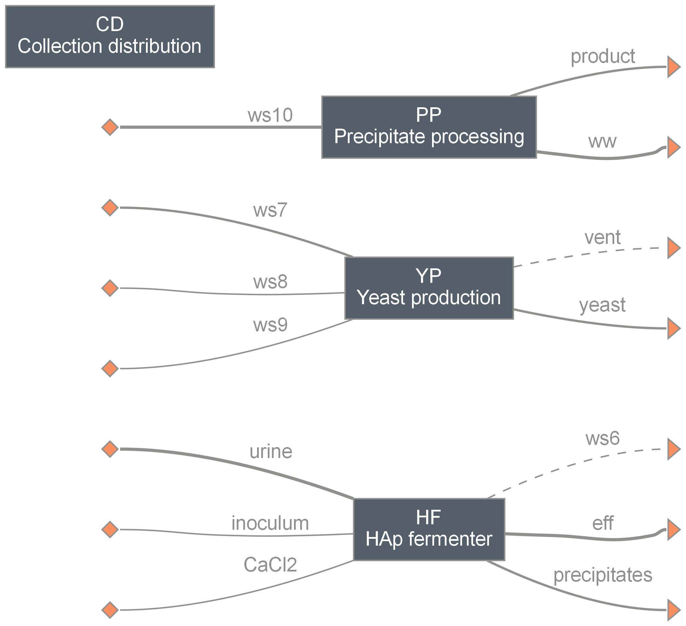

==============================================
hap: Hydroxyapatite (HAp) Synthesis from Urine
==============================================

Summary
-------
This module implements a city-scale system for HAp synthesis from source-separated urine using genetically engineered yeast cells. [1]_
Techno-economic analysis (TEA) of the system under uncertainty is enabled.

    *HAp system layout: distributed HAp fermenters and a centralized facility for yeast production and product processing connected through a collection-distribution system.*

Simulate an HAp system with default settings
--------------------------------------------
.. code-block:: python

  >>> # Load the system
  >>> from exposan.hap import create_system
  >>> sys = create_system()
  >>> sys.simulate() # doctest: +SKIP
  >>> # You can look at individual units or streams
  >>> u = sys.flowsheet.unit
  >>> s = sys.flowsheet.stream
  >>> u.HF
  HApFermenter: HF
  ins...
  [0] urine
  phase: 'l', T: 303.15 K, P: 101325 Pa
  flow (g/hr): H2O              3.1e+04
               NH3              15.1
               Urea             528
               Creatinine       45.7
               Hippuric_acid    27.9
               Citric_acid      16.5
               Glucuronic_acid  15.4
               Uric_acid        11.5
               Other_COD        113
               Cl               166
               Na               90.1
               K                54.4
               IS               31.8
               IP               25
      WasteStream-specific properties:
        pH         : 7.0
        COD        : 6950.9 mg/L
        BOD        : 2507.3 mg/L
        TC         : 5991.1 mg/L
        TOC        : 2731.2 mg/L
        TN         : 8695.1 mg/L
        TP         : 770.0 mg/L
        TK         : 1680.0 mg/L

  [1] inoculum
  phase: 'l', T: 298.15 K, P: 101325 Pa
  flow (g/hr): Yeast  16.2
     WasteStream-specific properties:
        pH         : 7.0
        COD        : 2448296.6 mg/L
        TC         : 818676.5 mg/L
        TOC        : 818676.5 mg/L
  [2] CaCl2
  phase: 'l', T: 298.15 K, P: 101325 Pa
  flow (g/hr): CaCl2  149
     WasteStream-specific properties:
        pH         : 7.0
  outs...
  [0] ws6
  phase: 'g', T: 310.15 K, P: 101325 Pa
  flow: 0
     WasteStream-specific properties: None for non-liquid waste streams
  [1] eff
  phase: 'l', T: 310.15 K, P: 101325 Pa
  flow (g/hr): H2O              2.99e+04
               NH3              315
               Creatinine       41.1
               Hippuric_acid    25.1
               Citric_acid      14.9
               Glucuronic_acid  13.9
               Uric_acid        10.4
               Other_COD        102
               Cl               166
               Na               90.1
               K                54.4
               IS               31.8
               IP               8.48
     WasteStream-specific properties:
        pH         : 7.0
        COD        : 6485.4 mg/L
        BOD        : 2339.4 mg/L
        TC         : 2548.2 mg/L
        TOC        : 2548.2 mg/L
        TN         : 8940.5 mg/L
        TP         : 271.4 mg/L
        TK         : 1741.6 mg/L
  [2] precipitates
  phase: 'l', T: 310.15 K, P: 101325 Pa
  flow (g/hr): H2O    1.07e+03
               Yeast  30.4
               HAP    89
     WasteStream-specific properties:
        pH         : 7.0
        COD        : 40223.3 mg/L
        TC         : 13450.1 mg/L
        TOC        : 13450.1 mg/L
        TP         : 13719.2 mg/L
  >>> # You can also look at a specific model
  >>> s.yeast
  WasteStream: yeast from <YeastProduction: YP>
  phase: 'l', T: 308.15 K, P: 101325 Pa
  flow (g/hr): H2O      3.29e+03
               Yeast    1.82e+03
               Ethanol  1.73
     WasteStream-specific properties:
        pH         : 7.0
        COD        : 645820.7 mg/L
        TC         : 215886.0 mg/L
        TOC        : 215886.0 mg/L
     Component concentrations (mg/L):
      H2O               731669.6
      Yeast             405722.7
      Ethanol           384.6

Retrieve TEA results
--------------------
.. code-block:: python

    >>> tea = sys.TEA
    >>> tea.show()
    TEA: sys
    NPV  : -6,023,755 USD at 5.0% discount rate
    >>> # You can also retrieve specific information
    >>> tea.AOC # annual operating cost
    472045.54493633664

Simulate the HAp system with uncertainty
----------------------------------------
Monte Carlo simulation of the HAp system can be performed with the ``run_model`` function built into the module.
A sample size ``N`` can be specified. Otherwise, N=100 by default. A ``seed`` can be provided for the random number generator and used for reproduction of the simulation results.
Simulation results can be visualized with the plotting functions in the ``analysis.py`` script.

References
----------
.. [1] Müller, Lin, Otani, and Zhang et al., Cost-effective urine recycling enabled by a synthetic osteoyeast platform for production of hydroxyapatite. *In Preparation*.
