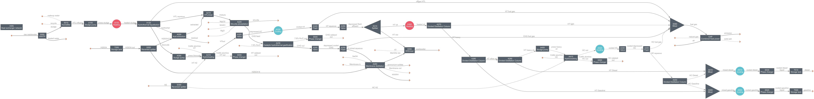

=============================================================================================
htl: Hydrothermal Liquefaction-based Wet Organic Waste Management / Biofuel Production System
=============================================================================================

Summary
-------
This module includes a hydrothermal liquefaction (HTL)-based system for wet organic waste management and biofuel production, as described in
Feng et al. [1]_

Key sanunits included in this module include:

  - hydrothermal liquefaction (``HydrothermalLiquefaction``)
  - catalytic hydrothermal gasification (``CatalyticHydrothermalGasification``)
  - hydrotreating (``Hydrotreaing``)
  - hydrocracking (``Hydrocracking``)
  - combined heat and power unit (``CombinedHeatPower``)

Feedstocks for the htl system are characterized by their moisture content and biochemical compositions (ash, lipid, protein, carbohydrate).
Tested feedstocks include:

  - wastewater sludge/biosolid
  - food waste
  - fats, oils, greases (FOG)
  - green waste (a.k.a. yard waste)
  - animal manure

The products of this system include:

  - struvite
  - ammonium sulfate
  - naphtha
  - renewable diesel
  - electricity

The system has three different configurations:

  - baseline (``configuration='baseline'``)
  - remove phosphorus extraction from hydrochar (``configuration='no_P'``)
  - add a pressure swing adsorption unit for hydrogen recycle (``configuration='PSA'``)

An example htl system layout (``configuration='baseline'``):

A full list of the packages in the environment used to generate the results is included in `htl.yml <https://github.com/QSD-Group/EXPOsan/blob/pfas/exposan/htl/htl.yml>`_.

Getting Started
---------------
.. code-block:: python

    >>> # create an htl system by specifying system configuration, capacity, and feedstock compositions:
    >>> from exposan.htl import create_system
    >>> sys = create_system(
    ...     configuration='baseline',             # system configurations ('baseline','no_P','PSA')
    ...     capacity=100,                         # capacity in dry metric tonne per day
    ...     sludge_moisture_content=0.7,          # the moisture content of the feedstock
    ...     sludge_dw_ash_content=0.257,          # the ash content of the feedstock (dry weight%)
    ...     sludge_afdw_lipid_content=0.204,      # the lipid content of the feedstock (ash-free dry weight%)
    ...     sludge_afdw_protein_content=0.463,    # the protein content of the feedstock (ash-free dry weight%)
    ...     N_2_P_value=0.3927,                     # the phosphorus to nitrogen mass ratio of the feedstock
    ...     )

    >>> sys.show()
    System: sys_baseline
    ins...
    [0] feedstock_assumed_in_wastewater  
        phase: 'l', T: 298.15 K, P: 101325 Pa
        flow (kmol/hr): H2O  8.73e+05
    [1] makeup_water  
        phase: 'l', T: 298.15 K, P: 101325 Pa
        flow: 0
    [2] recycle  
        phase: 'l', T: 298.15 K, P: 101325 Pa
        flow: 0
    [3] H2SO4  
        phase: 'l', T: 298.15 K, P: 101325 Pa
        flow (kmol/hr): H2O    677
                        H2SO4  6.09
    [4] MgCl2  
        phase: 's', T: 298.15 K, P: 101325 Pa
        flow (kmol/hr): MgCl2  0.933
    [5] NH4Cl  
        phase: 's', T: 298.15 K, P: 101325 Pa
        flow: 0
    [6] MgO  
        phase: 's', T: 298.15 K, P: 101325 Pa
        flow (kmol/hr): MgO  1.46
    [7] 7.8%_Ru/C  
        phase: 's', T: 298.15 K, P: 101325 Pa
        flow (kmol/hr): CHG_catalyst  0.745
    [8] NaOH  
        phase: 'l', T: 298.15 K, P: 101325 Pa
        flow (kmol/hr): NaOH  0.00203
    [9] Membrane_in  
        phase: 'l', T: 298.15 K, P: 101325 Pa
        flow (kmol/hr): Membrane  0.0966
    [10] H2  
         phase: 'l', T: 298.15 K, P: 101325 Pa
         flow (kmol/hr): H2  98.8
    [11] CoMo_alumina_HT  
         phase: 's', T: 298.15 K, P: 101325 Pa
         flow (kmol/hr): HT_catalyst  0.149
    [12] CoMo_alumina_HC  
         phase: 's', T: 298.15 K, P: 101325 Pa
         flow (kmol/hr): HC_catalyst  0.00532
    [13] s3  
         phase: 'l', T: 298.15 K, P: 101325 Pa
         flow: 0
    [14] natural_gas  
         phase: 'g', T: 298.15 K, P: 101325 Pa
         flow: 0
    [15] air  
         phase: 'g', T: 298.15 K, P: 101325 Pa
         flow (kmol/hr): O2  83.4
                         N2  314
    outs...
    [0] treated_water  
        phase: 'l', T: 298.15 K, P: 101325 Pa
        flow (kmol/hr): H2O  8.72e+05
    [1] residual  
        phase: 's', T: 333.15 K, P: 2.08891e+07 Pa
        flow (kmol/hr): Residual  327
    [2] struvite  
        phase: 's', T: 333.15 K, P: 101325 Pa
        flow (kmol/hr): Struvite  1.98
    [3] ammonium_sulfate  
        phase: 'l', T: 298.15 K, P: 101325 Pa
        flow (kmol/hr): NH42SO4  4.64
    [4] Membrane_out  
        phase: 'l', T: 298.15 K, P: 101325 Pa
        flow (kmol/hr): Membrane  0.0966
    [5] solution  
        phase: 'l', T: 298.15 K, P: 101325 Pa
        flow (kmol/hr): H2O    526
                        H2SO4  0.0898
    [6] gasoline  
        phase: 'l', T: 333.15 K, P: 137895 Pa
        flow (kmol/hr): C4H10      0.00747
                        TWOMBUTAN  0.0154
                        NPENTAN    0.11
                        TWOMPENTA  0.0579
                        CYCHEX     0.0277
                        HEXANE     0.0638
                        TWOMHEXAN  0.0509
                        ...        1.96
    [7] diesel  
        phase: 'l', T: 333.15 K, P: 128932 Pa
        flow (kmol/hr): C9H20   0.000619
                        C10H22  0.0833
                        C4BENZ  0.115
                        C11H24  0.307
                        C10H12  0.195
                        C12H26  0.254
                        C13H28  0.0671
                        ...     3.11
    [8] CHG_catalyst_out  
        phase: 's', T: 298.15 K, P: 101325 Pa
        flow (kmol/hr): CHG_catalyst  0.745
    [9] HT_catalyst_out  
        phase: 's', T: 298.15 K, P: 101325 Pa
        flow (kmol/hr): HT_catalyst  0.149
    [10] HC_catalyst_out  
         phase: 's', T: 298.15 K, P: 101325 Pa
         flow (kmol/hr): HC_catalyst  0.00532
    [11] wastewater  
         phase: 'l', T: 332.93 K, P: 344738 Pa
         flow (kmol/hr): H2O  1.14e+03
                         C    9.47
                         N    3.84
                         P    0.708
    [12] emission  
         phase: 'g', T: 298.15 K, P: 101325 Pa
         flow (kmol/hr): H2O  115
                         N2   314
                         CO2  42
    [13] solid_ash  
         phase: 's', T: 298.15 K, P: 101325 Pa
         flow: 0

    >>> # You can look at TEA and LCA results by:
    >>> sys.TEA
    HTL_TEA: sys_baseline
    NPV: -27,298,818 USD at 3.0% IRR

    >>> sys.LCA
    LCA: sys_baseline (lifetime 30 yr)
    Impacts:
                                        Construction  Transportation    Stream   Others     Total
    Ecotoxicity (kg 2,4-D-eq)               6.94e+06               0  2.69e+09 1.63e+08  2.86e+09
    OzoneDepletion (kg CFC-11-eq)              0.205               0      -104     33.9     -69.5
    Carcinogenics (kg benzene-eq)           1.22e+05               0  2.23e+05 2.95e+06   3.3e+06
    PhotochemicalOxidation (kg NOx-eq)      1.23e+04               0  5.33e+05 3.87e+05  9.33e+05
    Eutrophication (kg N)                      1e+03               0 -4.62e+05 3.48e+04 -4.26e+05
    RespiratoryEffects (kg PM2.5-eq)        1.49e+04               0   4.1e+05 2.43e+05  6.67e+05
    Acidification (moles of H+-eq)          1.27e+06               0  1.17e+08 4.54e+07  1.63e+08
    NonCarcinogenics (kg toluene-eq)        1.49e+08               0  7.26e+09 3.18e+09  1.06e+10
    GlobalWarming (kg CO2-eq)               4.87e+06               0    -1e+08 4.19e+08  3.24e+08

References
----------
.. [1] Feng et al., Characterizing the Opportunity Space for Sustainable Hydrothermal Valorization of Wet Organic Wastes. *Environmental Science and Technology*, *In revision*
