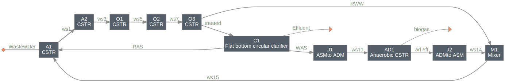
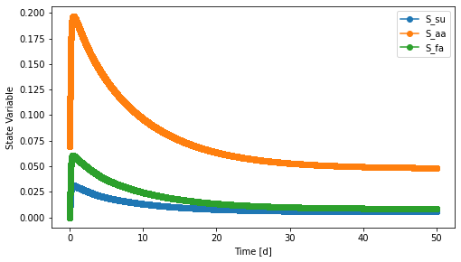

==========================================================
interface: Demo system for dynamic system with ASM and ADM
==========================================================

Summary
-------
This modules contains a simple system to show the use of units to enable dynamic simulation with more than one process models (``ADMtoASM`` and ``ASMtoADM`` for anaerobic digestion model no.1 and activated sludge model no.1) .

The system contains the entire Benchmark Simulation Model No. 1 (BSM1) [1]_ configuration as modeled in the `bsm1 <https://github.com/QSD-Group/EXPOsan/tree/main/exposan/bsm1>`_ module. But the waste activated sludge from the clarifier is sent to an anaerobic digester (AD), and the effluent from the AD is recycled into the first activated sludge bioreactor.

    *Interface system layout: BSM1 with an anaerobic digester*

Load the system
---------------
.. code-block:: python

	>>> from exposan import interface
	>>> interface.load()
	>>> sys = interface.sys
	>>> sys.simulate(t_span=(0, 50))
	>>> u = sys.flowsheet.unit # unit registry
	>>> # Check the states of any one or more components
	>>> fig, axis = u.AD1.scope.plot_time_series(u.AD1.components.IDs[:3])
	>>> fig

    *Select component states from the anaerobic digester in the interface system*

References
----------
.. [1] Alex et al., Benchmark simulation model no. 1 (BSM1). Report by the IWA Taskgroup on benchmarking of control strategies for WWTPs (2008): 19-20. `<http://iwa-mia.org/benchmarking/#BSM1>`_