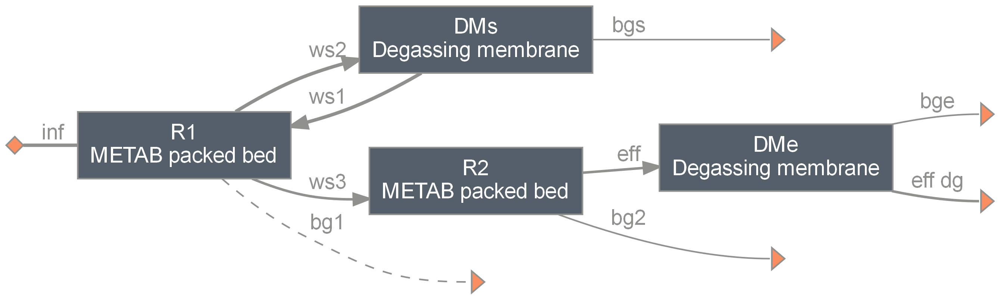

=================================================================
metab: Modular Encapsulated Two-stage Anaerobic Biological system
=================================================================

Summary
-------
This module serves as a process simulator for the Modular Encapsulated Two-stage Anaerobic Biological (METAB) system and its design variants,
as described in Zhang et al. [1]_

This module include a "flexible" version of the Anaerobic Digestion Model no.1 (ADM1) [2]_, which enables ideal control of pH and estimation
of the required acid/base dosing by directly setting a target pH.

Multiple reactor types for the METAB system are included in the ``units.py`` file in this module:

  - upflow sludge blanket reactor (``UASB``)
  - fluidized bed reactor (``METAB_FluidizedBed``)
  - packed bed reactor (``METAB_PackedBed``)
  - batch experiment reactor (``METAB_BatchExp``)

Among them, ``METAB_FluidizedBed``, ``METAB_PackedBed``, and ``METAB_BatchExp`` include a micro-scale mechanistic model of mass transfer through
encapsulation matrix in reactor mass balance.

    *An example METAB system layout: two packed bed reactors in series with sidestream membrane gas extraction at the 1st stage and effluent degassing.*

To reproduce the results and figures included in Zhang et al. [1]_, run corresponding functions in ``analyses.py``. You can find a full list of the
packages in the environment used to generate the results in `qsdsan.yml <https://github.com/QSD-Group/EXPOsan/blob/main/exposan/metab/qsdsan.yml>`_.

Getting Started
---------------
.. code-block:: python

    >>> # create a METAB system by specifying reactor type, gas extraction method, design HRT etc.
    >>> from exposan.metab import create_system
    >>> sys = create_system(
    ...     n_stages=2,         # number of stages
    ...     reactor_type='PB',  # PB for packed bed, FB for fluidized bed, or UASB
    ...     gas_extraction='M', # M for membrane gas extraction, V for vacuum extraction, P for passive venting
    ...     Q=5,                # influent flowrate in m3/d
    ...     T=22,               # reactor temperature in degree C
    ...     tot_HRT=12,         # total HRT in d
    ...     )

    >>> # Simulate the system for 200 days
    >>> sys.simulate(state_reset_hook='reset_cache', t_span=(0,200), method='BDF')
    System: PB2M_edg
    Highest convergence error among components in recycle
    streams {DMs-1} after 3 loops:
    - flow rate   1.82e-12 kmol/hr (4e-14%)
    - temperature 0.00e+00 K (0%)
    ins...
    [0] inf
        phase: 'l', T: 295.15 K, P: 101325 Pa
        flow (kmol/hr): S_su   0.00347
                        S_aa   0.125
                        S_fa   0.000325
                        S_va   0.000816
                        S_bu   0.000957
                        S_pro  0.00114
                        S_ac   0.00141
                        ...    11.6
    outs...
    [0] bg1
        phase: 'g', T: 295.15 K, P: 101325 Pa
        flow: 0
    [1] bg2
        phase: 'g', T: 295.15 K, P: 101325 Pa
        flow (kmol/hr): S_h2   1.49e-07
                        S_ch4  0.0589
                        S_IC   0.000946
                        H2O    0.000489
    [2] bge
        phase: 'g', T: 295.15 K, P: 101325 Pa
        flow (kmol/hr): S_h2   3.76e-10
                        S_ch4  0.000449
                        S_IC   0.000413
    [3] eff_dg
        phase: 'l', T: 295.15 K, P: 101325 Pa
        flow (kmol/hr): S_su   2.28e-07
                        S_aa   4.9e-05
                        S_fa   7.64e-06
                        S_va   5.64e-07
                        S_bu   8.55e-07
                        S_pro  8.7e-07
                        S_ac   7.4e-06
                        ...    11.7
    [4] bgs
        phase: 'g', T: 295.15 K, P: 101325 Pa
        flow (kmol/hr): S_h2   1.01e-05
                        S_ch4  0.0213
                        S_IC   0.00291

    >>> # You can look at TEA and LCA results after simulation
    >>> sys.TEA
    TEA: PB2M_edg
    NPV  : -1,413,755 USD at 10.0% discount rate

    >>> sys.LCA
    LCA: PB2M_edg (lifetime 30 yr)
    Impacts:
                        Construction  Transportation    Stream   Others    Total
    ODP (kg CFC-11-Eq)        0.0196               0   -0.0322   0.0252   0.0126
    HTNC (CTUh)                 0.18               0   -0.0046    0.121    0.296
    EP (kg N-Eq)            1.65e+03               0     -27.6 3.24e+03 4.87e+03
    PMFP (PM2.5-Eq)              467               0     -16.3 1.27e+03 1.72e+03
    MIR (kg O3-Eq)          2.92e+04               0 -2.32e+03  1.4e+04 4.09e+04
    EF (CTUe)               1.25e+07               0 -2.33e+05 5.11e+06 1.74e+07
    GWP100 (kg CO2-Eq)       5.6e+05               0 -3.78e+04 4.45e+05 9.67e+05
    HTC (CTUh)                 0.061               0  -0.00259   0.0375   0.0959
    AP (kg SO2-Eq)          2.52e+03               0      -205      946 3.26e+03

References
----------
.. [1] Zhang et al., Prioritization of Early-Stage Research and Development of a Hydrogel-Encapsulated Anaerobic Technology for Distributed Treatment of High Strength Organic Wastewater. Environ. Sci. Technol. 2024, 58, 44, 19651–19665. `<https://doi.org/10.1021/acs.est.4c05389>`_
.. [2] IWA Task Group for Mathematical Modelling of Anaerobic Digestion Processes. Anaerobic Digestion Model No.1 (ADM1); IWA Publishing, 2005. `<https://doi.org/10.2166/9781780403052>`_
