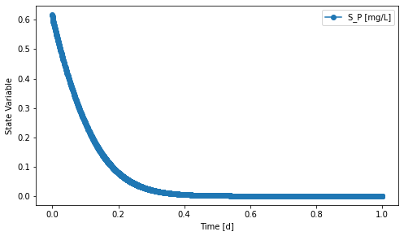

=====================================================================================
pm2_batch: Calibration & Validation of Phototrophic-Mixotrophic Process Model (PM2)
=====================================================================================

Summary
-------
This module is used to calibrate and validate the Phototrophic-Mixotrophic Process Model (PM2; ``qsdsan.processes.PM2``) using batch experiment results.

.. figure:: ./readme_figures/pm2_batch.svg

   *Layout of the system used for the calibration and validation of PM2 implemented in QSDsan*

- ``system.py`` constructs the batch system above.
- ``model.py`` creates a model for uncertainty and sensitivity analysis.
- ``analyses.py`` runs uncertainty and sensitivity analysis and plots the results.

Load the system
---------------
.. code-block:: python

   >>> from exposan import pm2_batch
   >>> pm2_batch.load()
   >>> sys = pm2_batch.sys
   >>> sys.simulate(t_span=(0,1), method='RK23')
   >>> PBR = pm2_batch.PBR
   >>> fig, axis = PBR.scope.plot_time_series(('S_P'))
   >>> fig

    *Phosphorus removal in the batch setting*

