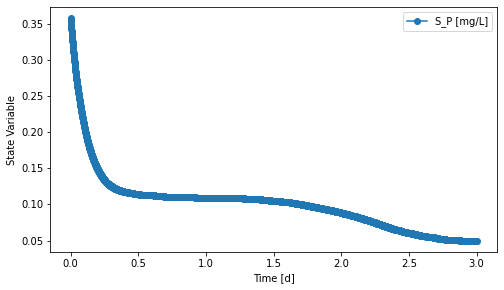

===========================================================================================
pm2_ecorecover: Calibration & Validation of Phototrophic-Mixotrophic Process Model (PM2)
===========================================================================================

Summary
-------
This module is used to calibrate and validate the Phototrophic-Mixotrophic Process Model (PM2; ``qsdsan.processes.PM2``) using the continuous online monitoring data from the EcoRecover plant

.. figure:: ./readme_figures/pm2_ecorecover.svg

   *Layout of the system used for the calibration and validation of PM2 implemented in QSDsan*

- ``system.py`` constructs the batch system above.
- ``model.py`` creates a model for uncertainty and sensitivity analysis.
- ``analyses.py`` runs uncertainty and sensitivity analysis and plots the results.
- ``calibration.py`` calibrates model parameters.
- ``calibration_result.py`` is used to check the calibration restuls.
- ``validation_result.py`` is used to check the validation restuls.

Load the system
---------------
.. code-block:: python

   >>> from exposan import pm2_ecorecover
   >>> pm2_ecorecover.load()
   >>> sys = pm2_ecorecover.sys
   >>> sys.simulate(t_span=(0,3), method='RK23')
   >>> PBR = pm2_ecorecover.PBR20
   >>> fig, axis = PBR.scope.plot_time_series(('S_P'))
   >>> fig

    *Phosphorus removal in the EcoRecover system*

