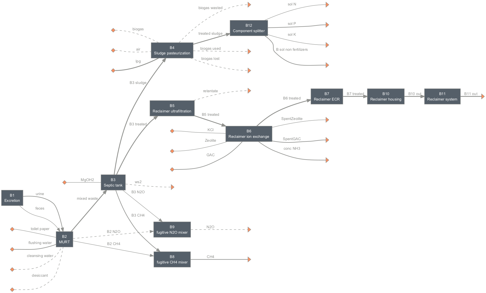

=========
Reclaimer
=========

Summary
-------
Systems included in this module are based on the work described in Trotochaud et al., [1]_ for the Reclaimer 2.0 system designed by researchers at Duke University.

Four system configurations are included in this module.

.. figure:: ./figures/sysA.png

    *Scenario A (sysA): solids treatment only*

    *Scenario B (sysB): full system with grid-tied electricity*

.. figure:: ./figures/sysC.png

    *Scenario C (sysC): full system with photovoltaic (solar) electricity*

.. figure:: ./figures/sysD.png

    *Scenario D (sysD): target N removal only with grid-tied electricity*

Loading systems
---------------
.. code-block:: python

    >>> # Import and load the system
    >>> from exposan import reclaimer as re
    >>> re.load()
    >>> # Quick look at the systems
    >>> re.sysB.show() # doctest: +ELLIPSIS
    System: sysB
    ins...
    [0] toilet_paper
        phase: 'l', T: 298.15 K, P: 101325 Pa
        flow (kmol/hr): Tissue  0.000282
    [1] flushing_water
        phase: 'l', T: 298.15 K, P: 101325 Pa
        flow (kmol/hr): H2O  0.0231
    [2] cleansing_water
        phase: 'l', T: 298.15 K, P: 101325 Pa
        flow: 0
    [3] desiccant
        phase: 'l', T: 298.15 K, P: 101325 Pa
        flow: 0
    [4] MgOH2
        phase: 's', T: 298.15 K, P: 101325 Pa
        flow (kmol/hr): MgOH2  0.000794
    [5] biogas
        phase: 'g', T: 298.15 K, P: 101325 Pa
        flow: 0
    [6] air
        phase: 'g', T: 298.15 K, P: 101325 Pa
        flow: 0
    [7] lpg
        phase: 'l', T: 298.15 K, P: 101325 Pa
        flow (kmol/hr): LPG  0.0135
    [8] Zeolite
        phase: 's', T: 298.15 K, P: 101325 Pa
        flow (kmol/hr): Zeolite  5.14e-05
    [9] GAC
        phase: 's', T: 298.15 K, P: 101325 Pa
        flow (kmol/hr): GAC  0.00426
    [10] KCl
        phase: 's', T: 298.15 K, P: 101325 Pa
        flow (kmol/hr): KCl  4.31e-05
    outs...
    [0] B11_out
        phase: 'l', T: 298.15 K, P: 101325 Pa
        flow (kmol/hr): NH3     1.24e-05
                        NonNH3  0.000457
                        P       1.35e-05
                        K       0.000236
                        H2O     2.63
                        Tissue  0.0277
    [1] sol_N
        phase: 'l', T: 298.15 K, P: 101325 Pa
        flow (kmol/hr): NH3     0.000272
                        NonNH3  0.0001
    [2] sol_P
        phase: 'l', T: 298.15 K, P: 101325 Pa
        flow (kmol/hr): P         2.96e-06
                        Struvite  0.000149
    [3] sol_K
        phase: 'l', T: 298.15 K, P: 101325 Pa
        flow (kmol/hr): K  5.16e-05
    [4] B_sol_non_fertilizers
        phase: 'l', T: 298.15 K, P: 101325 Pa
        flow (kmol/hr): Mg       9.26e-05
                        Ca       0.000272
                        H2O      0.00328
                        OtherSS  0.468
                        Tissue   0.00606
    [5] ws2
        phase: 'l', T: 298.15 K, P: 101325 Pa
        flow: 0
    [6] biogas_used
        phase: 'g', T: 298.15 K, P: 101325 Pa
        flow: 0
    [7] biogas_lost
        phase: 'g', T: 298.15 K, P: 101325 Pa
        flow: 0
    [8] biogas_wasted
        phase: 'g', T: 298.15 K, P: 101325 Pa
        flow: 0
    [9] retentate
        phase: 'l', T: 298.15 K, P: 101325 Pa
        flow: 0
    [10] SpentZeolite
        phase: 's', T: 298.15 K, P: 101325 Pa
        flow (kmol/hr): NH3      6.15e-05
                        Zeolite  5.14e-05
    [11] SpentGAC
        phase: 's', T: 298.15 K, P: 101325 Pa
        flow (kmol/hr): GAC  0.00426
    [12] conc_NH3
        phase: 's', T: 298.15 K, P: 101325 Pa
        flow (kmol/hr): NH3  0.00117
    [13] CH4
        phase: 'g', T: 298.15 K, P: 101325 Pa
        flow (kmol/hr): CH4  0.00196
    [14] N2O
        phase: 'g', T: 298.15 K, P: 101325 Pa
        flow: 0
    >>> # You can look at individual units
    >>> re.B5.show() # doctest: +ELLIPSIS
    ReclaimerUltrafiltration: B5
    ins...
    [0] B3_treated  from  SepticTank-B3
        phase: 'l', T: 298.15 K, P: 101325 Pa
        flow (g/hr): NH3     21.2
                     NonNH3  6.41
                     P       0.42
                     K       9.23
                     H2O     4.74e+04
                     Tissue  27.7
        WasteStream-specific properties:
         pH         : 7.0
         COD        : 724.6 mg/L
         TN         : 578.7 mg/L
         TP         : 8.8 mg/L
         TK         : 193.8 mg/L
    outs...
    [0] B5_treated  to  ReclaimerIonExchange-B6
        phase: 'l', T: 298.15 K, P: 101325 Pa
        flow (g/hr): NH3     21.2
                     NonNH3  6.41
                     P       0.42
                     K       9.23
                     H2O     4.74e+04
                     Tissue  27.7
        WasteStream-specific properties:
         pH         : 7.0
         COD        : 724.6 mg/L
         TN         : 578.7 mg/L
         TP         : 8.8 mg/L
         TK         : 193.8 mg/L
    [1] retentate
        phase: 'l', T: 298.15 K, P: 101325 Pa
        flow: 0
        WasteStream-specific properties: None for empty waste streams

Techno-economic analysis and life cycle assessment (TEA/LCA)
------------------------------------------------------------
TEA and LCA are performed through :class:`TEA` and :class:`LCA` objects and named as "teaA", "lcaA", etc.

.. code-block:: python

    >>> # Check the TEA results for `sysA`
    >>> re.teaB.show() # doctest: +SKIP
    SimpleTEA: sysB
    NPV  : -58,023 USD at 5.0% discount rate
    >>> # There are also handy functions to allow you quickly see important results
    >>> re.print_summaries(re.sysB) # doctest: +SKIP

    ---------- Summary for sysB ----------

    Total N recovery: 71.4 %.

    Total P recovery: 91.8 %.

    Total K recovery: 17.9 %.

    Total cost: 41.29 USD/cap/yr.

    Net emission: 154.21 kg CO2-eq/cap/yr.

    Net ecosystems damage: -0.06 points/cap/yr.

    Net health damage: 29.98 points/cap/yr.

    Net resources damage: -0.27 points/cap/yr.
    >>> # You can also save system reports
    >>> # re.sysB.save_report('full_file_path.xlsx')

Uncertainty and sensitivity analyses
------------------------------------
Uncertainty and sensitivity analyses are performed through :class:`Model` objects. Four models (``modelA`` to ``modelD`` for ``sysA`` to ``sysD``, respectively) have been added.

You can make changes (e.g., add or remove parameters, change uncertainty ranges) to these models or construct your own ones.

.. code-block:: python

    >>> # Run the default model for `sysA`
    >>> modelA = re.create_model('A')
    >>> # Try use larger samples, here is just to get a quick demo result
    >>> # The result will be automatically saved under the results folder
    >>> re.run_uncertainty(modelA, N=10) # doctest: +ELLIPSIS
    function `run_uncertainty`
    Total ...

Contextual analysis
-------------------
The ``country_specific.py`` module contains scripts to evaluate the system with contextual parameters that are specific to the deployed country.

References
----------
.. [1] Trotochaud et al., Laboratory Demonstration and Preliminary Techno-Economic Analysis of an Onsite Wastewater Treatment System, Environ. Sci. Technol., 2020, 54, 16147–16155.