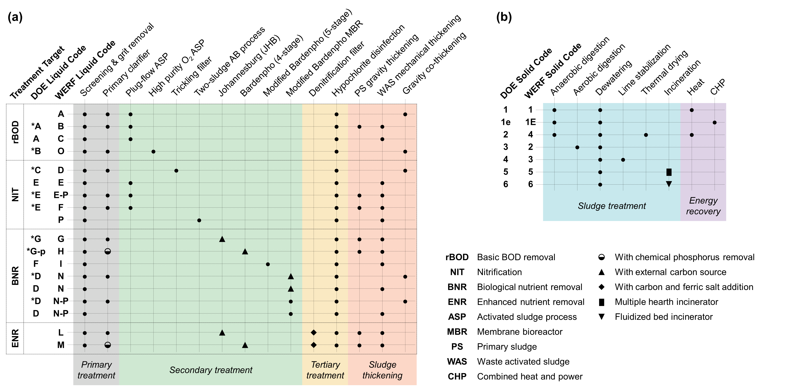
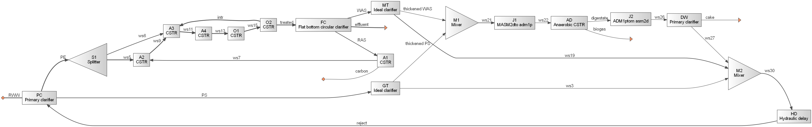

=================================================================================
werf: Benchmark Models for Water Resource Recovery Facilities (WRRF) in the US
=================================================================================

Summary
-------
This module contains benchmark models of typical WRRF configurations in the US [1]_, [2]_. Configuration IDs are indicative of the combination of liquid and solids treatment trains, according to the WERF codes below. 

**18 of the possible configurations are available**, including their plant-wide dynamic simulations, operational energy demand estimation, and OPEX accounting. More configurations to follow.

    *Benchmark liquid and solids treatment trains.*
    

Load the system
---------------
.. code-block:: python

	>>> from exposan.werf import create_system
	>>> g1 = create_system('G1')
	>>> # g1.simulate(method='BDF', t_span=(0, 300))
	>>> # Check the states of any one or more components
	>>> # fig, axis = g1.AD.scope.plot_time_series(('S_fa', 'S_bu', 'S_va', 'S_pro', 'S_ac'))
	>>> # fig

    *G1 flow diagram.*

References
----------
.. [1] Tarallo, S.; Shaw, A.; Kohl, P.; Eschborn, R. A Guide to Net-Zero Energy Solutions for Water Resource Recovery Facilities; ENER1C12; The Water Environment Research Foundation, 2015. `<https://doi.org/10.2166/9781780407685>`_.
.. [2] El Abbadi, S. H.; Feng, J.; Hodson, A. R.; Amouamouha, M.; Busse, M. M.; Polcuch, C.; Zhou, P.; Macknick, J.; Guest, J. S.; Stokes-Draut, J. R.; Dunn, J. B. Benchmarking Greenhouse Gas Emissions from U.S. Wastewater Treatment for Targeted Reduction. 2024. `<https://doi.org/10.31223/X5VQ59>`_
